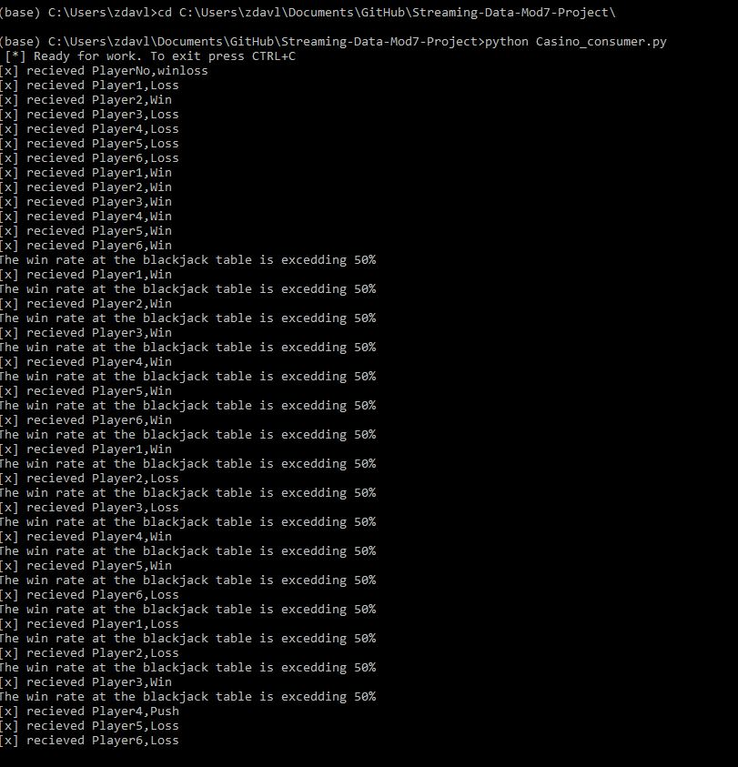

# Streaming-Data-Mod7-Project
This project is going to stream Black jack hands to a casino consumer and notify them if a table starts to have a higher then 50% win rate. This can be adjusted in the program.

The average black jack hand has a win rate of about 42.22%.
 We will observe a 1 hour window and check to see if out of all players there is an unsual win rate. (Bad dealer, card counting etc.)
 In order to make this easier to observe I will make each round in the program 5 seconds (to simulate 5 minutes) and each hour a 1 min window.
 These values can be changed by the user.

